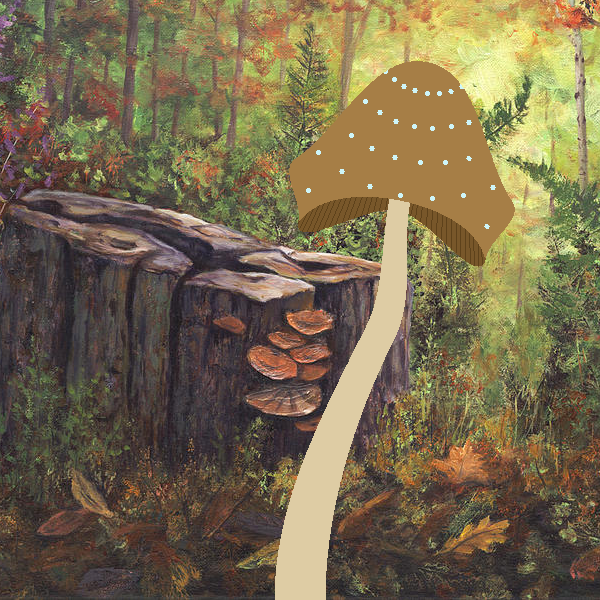
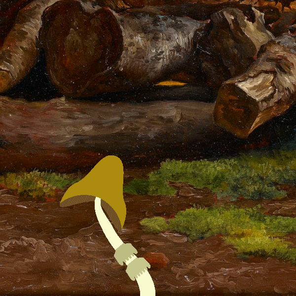

```
       -----------
     / (_)_   _    \
  /)     (_) (_)      \
 |      _          _   |   __  __   _    _    _____   _    _   _____     ____     ____    __  __    _____
| _    (_)   _    (_) _ | |  \/  | | |  | |  / ____| | |  | | |  __ \   / __ \   / __ \  |  \/  |  / ____|
|(_)  _     (_)  _   (_)| | \  / | | |  | | | (___   | |__| | | |__) | | |  | | | |  | | | \  / | | (___
|____(_)________(_)_____| | |\/| | | |  | |  \___ \  |  __  | |  _  /  | |  | | | |  | | | |\/| |  \___ \
 \\\\\\\\||||||||///////  | |  | | | |__| |  ____) | | |  | | | | \ \  | |__| | | |__| | | |  | |  ____) |
         |      |         |_|  |_|  \____/  |_____/  |_|  |_| |_|  \_\  \____/   \____/  |_|  |_| |_____/
         |      |
         |      |
          \____/
#########################################################################################################
```

Small Script to generate mushrooms. Can you find them all?

Run with

> python main.py

`Click` or press `N` to generate a new mushroom\
Press `B` to generate only a new color pallet\
Press `S` to save the mushroom as an image

To add more mushroom features new Specs can be created. This is done by adding a new class in the Spec.py file that corresponds to the parameters being adjusted. The newly created class also needs to be added to the corresponding list in `Mushroom().__init__()`

Mushroom parameters can also be overriden for all mushrooms by specifying values in `SpecOverride.py`

# Large Brown Cap

\

# Small Yellow Mushroom

\

# Tall Toadstool

\
